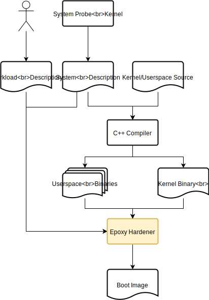

# Epoxy

[](https://github.com/emersion/stability-badges#experimental)


Epoxy is my private hobby experiment in designing a
as-static-as-possible separation kernel that still supports highly
configurable workloads. This repository contains the part that takes
compiled binaries and creates a boot image for a particular system out
of it.

The actual kernel and userspace binaries for RISC-V can be found at
the [Epoxy RISC-V](https://github.com/blitz/epoxy-riscv/) repository.

## Building using stack

Using the Haskell [Stack](https://haskellstack.org/), you can build
this program and execute its tests via:

```sh
% stack build
% stack test
```

## Building using Nix

If you don't plan to do any development, the most convenient way to
build is to use [Nix](https://nixos.org/nix/):

```sh
% nix build -f . epoxyHarden
```

To speed up build times, you can use my [Cachix](https://cachix.org)
cache:

```sh
% cachix use blitz
```

## Overview

The core idea of epoxy is to move complexity of the running system to
build time and minimize mutable state at runtime. This is primarily
achieved by specializing boot images for a specific target system and
workload and statically allocating all data structures in the
kernel. The kernel itself can use other properties of the target
system to further simplify the running image, but this is not in scope
for this document.



The tool receives the following inputs:

- a system description,
- a workload description,
- the userspace binaries referenced in the workload description,
- the not quite finished kernel binary.

The _system description_ is a JSON file that describes the properties
of the target system. The important information in this description
for this tool is the memory layout.

The _workload description_ is another JSON file that describes the set
of userspace processes that make up the desired workload. At this
point, it is mostly a list of userspace binaries. In the future, this
file also sets up capabilities, device and IRQ access. The userspace
binaries are normal statically linked ELF binaries.

The not quite finished kernel binary is also a normal statically
linked ELF binary with a twist: It contains placeholders where the
tool will patch in page tables and other data structures that can be
statically generated.

The tool will combine all of these inputs into a ready to run ELF
binary, that we'll call the _target boot image_.

## Developing

This section contains information related to actually hacking on the code.

### Updating Dependencies

To update the [Stackage](https://www.stackage.org/) snapshot we build
against, update the resolver in `stack.yaml`. Then execute:

```sh
% niv update
% stack-to-nix --output . --stack-yaml stack.yaml
```
